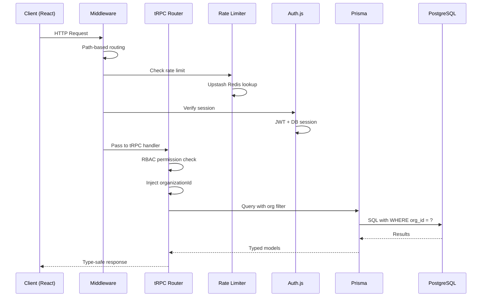
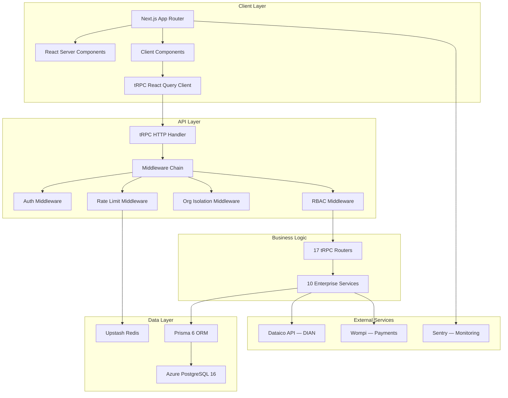
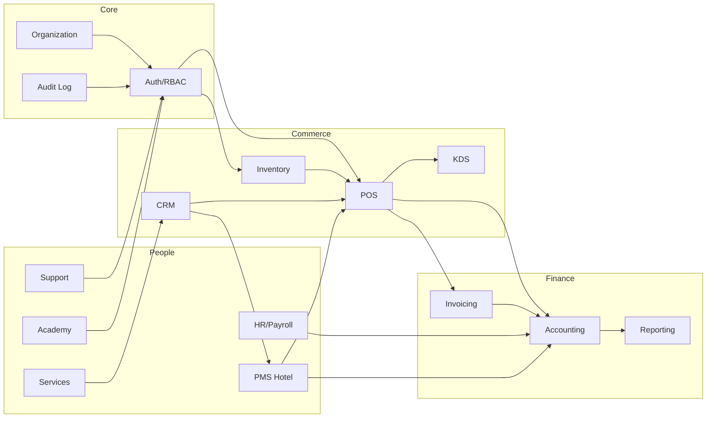
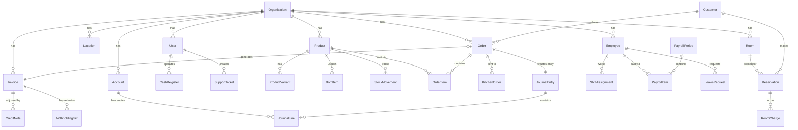
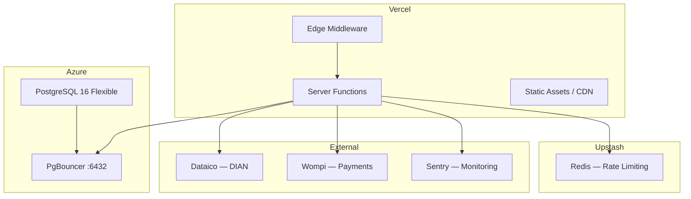

# Architecture — Odxis ERP

## System Overview

Odxis is a monolithic Next.js application following the **T3 Stack** pattern — tRPC for the API layer, Prisma for data access, and Auth.js for authentication. The multi-tenant architecture uses row-level data isolation via `organizationId` enforced in tRPC middleware.

## Request Lifecycle



## Application Layers



## Multi-Tenant Data Isolation

Every data model includes an `organizationId` foreign key. The tRPC middleware automatically injects the organization context:

```
publicProcedure
  → authenticate (Auth.js session)
  → rateLimit (Upstash Redis)
  → injectOrganizationId (from session)
  → enforcePermission (RBAC check)
  → handler (business logic)
```

All queries are automatically scoped:

```
WHERE organizationId = ctx.session.user.organizationId
```

This ensures complete data isolation between tenants without database partitioning.

## Module Dependency Graph



## Database Schema Overview



## Deployment Architecture



## Key Design Decisions

| Decision | Rationale |
|----------|-----------|
| **Monolith over Microservices** | Single team, shared data model, lower operational complexity |
| **tRPC over REST/GraphQL** | End-to-end type safety, zero code generation, smaller bundle |
| **Row-level isolation over schema-per-tenant** | Simpler migrations, lower cost, sufficient for target scale |
| **COP as integers** | Avoids floating-point rounding errors in financial calculations |
| **PUC chart of accounts** | Standard Colombian accounting classification |
| **Middleware-enforced RBAC** | Consistent security enforcement across all endpoints |
| **Automatic journal entries** | POS sales, payroll, and inventory automatically create accounting entries |
