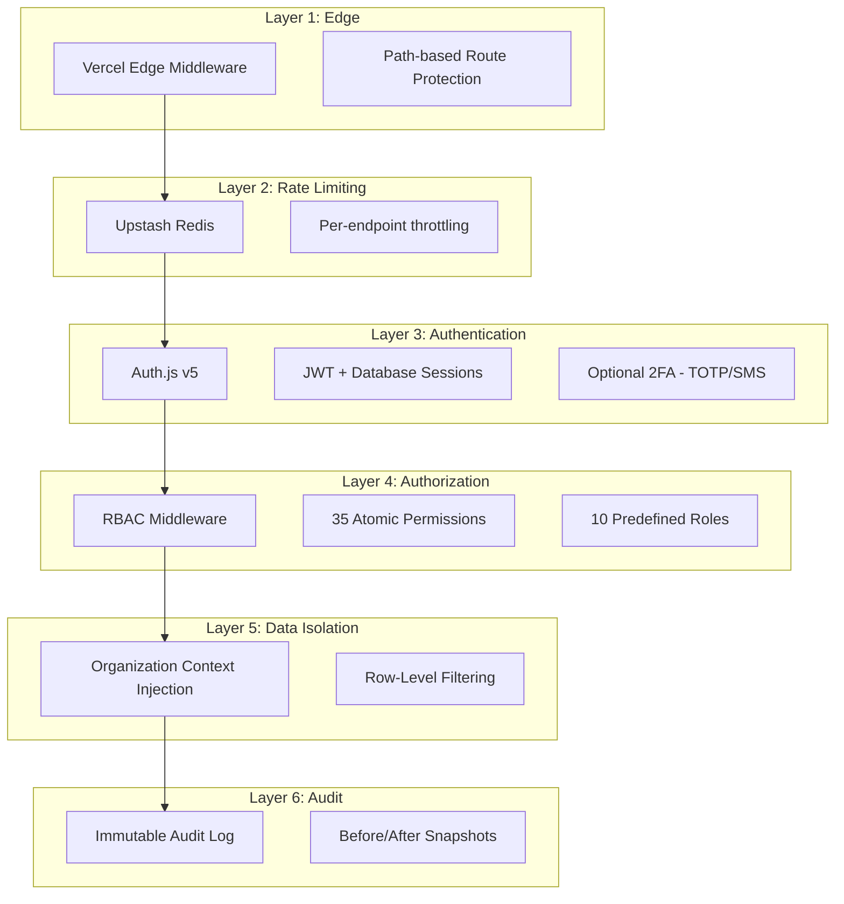
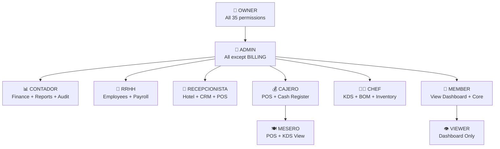

# Security Model — Odxis ERP

Comprehensive security architecture for a multi-tenant ERP handling financial data, PII, and regulatory compliance (DIAN/CST).

---

## Defense in Depth



---

## Authentication

### Auth.js v5 (NextAuth)

- **Provider**: Credentials (email + bcrypt-hashed password)
- **Session strategy**: JWT with database session validation
- **Password hashing**: bcrypt with automatic salt generation
- **Session data**: User ID, organization ID, role, permissions array

### Two-Factor Authentication (2FA)

| Method | Implementation |
|--------|---------------|
| **TOTP** | Authenticator app (Google Authenticator, Authy) |
| **SMS** | Phone-based verification code |
| **Email** | Email verification code |
| **Backup codes** | One-time recovery codes stored hashed |

### Session Security

- JWT tokens with appropriate expiration
- Database session validation on protected routes
- Automatic session invalidation on critical changes

---

## Authorization — RBAC

### Permission Architecture

The RBAC system follows the **MODULO.ACCION** convention with 35 atomic permissions grouped by module domain:

```
VIEW_DASHBOARD                    → Read dashboard
VIEW_INVENTORY / MANAGE_INVENTORY → Read / Write inventory
MANAGE_WAREHOUSES                 → Manage warehouse configuration
MANAGE_BOM                        → Manage recipes and bill of materials
MANAGE_TRANSFERS                  → Inter-warehouse stock transfers
VIEW_POS / MANAGE_POS             → Read / Write POS orders
MANAGE_CASH_REGISTER              → Open/close cash registers
APPLY_DISCOUNTS                   → Apply order discounts
VOID_ORDERS                       → Cancel/void orders
VIEW_POS_METRICS                  → Access POS analytics
VIEW_KDS / MANAGE_KDS             → Read / Write kitchen orders
VIEW_CRM / MANAGE_CRM             → Read / Write customer data
VIEW_ACCOUNTING / MANAGE_ACCOUNTING → Read / Write journal entries
VIEW_REPORTS                      → Access financial reports
VIEW_INVOICES / MANAGE_INVOICES   → Read / Write invoices
EMIT_ELECTRONIC_INVOICE           → Submit to DIAN
VIEW_PAYROLL / MANAGE_PAYROLL     → Read / Write payroll
MANAGE_EMPLOYEES                  → Employee CRUD
MANAGE_SHIFTS                     → Shift scheduling
VIEW_ROOMS / MANAGE_ROOMS         → Read / Write hotel rooms
MANAGE_RESERVATIONS               → Hotel reservation management
MANAGE_HOUSEKEEPING               → Housekeeping task management
CHARGE_TO_ROOM                    → Add charges to room folio
VIEW_ACADEMY / MANAGE_ACADEMY     → Read / Write courses/lessons
MANAGE_SUPPORT                    → Support ticket management
MANAGE_USERS                      → User administration
MANAGE_LOCATIONS                  → Location/branch management
MANAGE_ORGANIZATION               → Tenant settings
VIEW_AUDIT_LOGS                   → Access audit trail
MANAGE_BILLING                    → Subscription and payment management
```

### Role Hierarchy



### Enforcement

Permissions are checked at the **tRPC middleware layer** via `enforcePermission()`:

```
protectedProcedure
  .use(enforcePermission("MANAGE_INVENTORY"))
  .mutation(async ({ ctx, input }) => {
    // Only executes if user has MANAGE_INVENTORY permission
    // ctx.session.user.organizationId is automatically injected
  })
```

---

## Multi-Tenant Data Isolation

### Row-Level Isolation

Every data model includes `organizationId` as a mandatory foreign key with cascade delete. The tRPC middleware automatically:

1. Extracts `organizationId` from the authenticated session
2. Injects it into the Prisma query context
3. All queries are scoped: `WHERE organizationId = ?`

This ensures **complete data isolation** between tenants without database-level partitioning, while maintaining simplicity for migrations and schema changes.

### Organization Cascade

```
Organization (deleted) → CASCADE deletes:
  ├── Users
  ├── Locations
  ├── Products → Variants, Attributes, BOM, Stock Movements
  ├── Orders → Order Items, Kitchen Orders
  ├── Invoices → Credit Notes, Withholding Taxes
  ├── Accounts → Journal Lines
  ├── Employees → Shifts, Payroll Items, Leave Requests, Documents
  ├── Rooms → Reservations, Room Charges
  ├── Support Tickets
  ├── Cash Registers
  └── Audit Logs
```

---

## Rate Limiting

**Provider**: Upstash Redis (serverless, globally distributed)

Per-endpoint rate limiting prevents API abuse:

- Authentication endpoints: Strict limits (brute-force protection)
- CRUD operations: Standard limits per user
- Report generation: Lower limits (computationally expensive)
- Public endpoints: IP-based limiting

---

## Audit Trail

### Immutable Audit Log

Every state-changing operation records:

| Field | Description |
|-------|-------------|
| `action` | CREATE, UPDATE, DELETE |
| `entity` | Model name (Product, Order, Invoice, etc.) |
| `entityId` | Affected record ID |
| `userId` | Who performed the action |
| `userName` | Snapshot of user name (immutable) |
| `dataBefore` | Previous state (JSON) |
| `dataAfter` | New state (JSON) |
| `ipAddress` | Client IP address |
| `createdAt` | Timestamp (no updatedAt — immutable) |

### Audit Export

The `audit-export.ts` service supports exporting audit trails in:
- **CSV** — Spreadsheet-compatible
- **PDF** — Formatted reports
- **JSON** — Machine-readable

---

## Compliance

### Financial Data

- All monetary values stored as **integers** (COP, no decimals) to avoid floating-point errors
- Double-entry accounting with balanced journal entries
- Fiscal period locking to prevent retroactive changes
- Withholding tax calculation per Colombian law

### DIAN (Tax Authority)

- UBL 2.1 XML generation for electronic invoices
- CUFE (unique invoice code) generation
- Resolution validation (prefix, numbering range, expiry)
- Dataico API integration for official submission

### Personal Data

- Employee PII (personal identification, banking, health provider)
- Bcrypt password hashing
- 2FA secrets encrypted
- Backup codes stored hashed
- RBAC prevents unauthorized access to sensitive data
