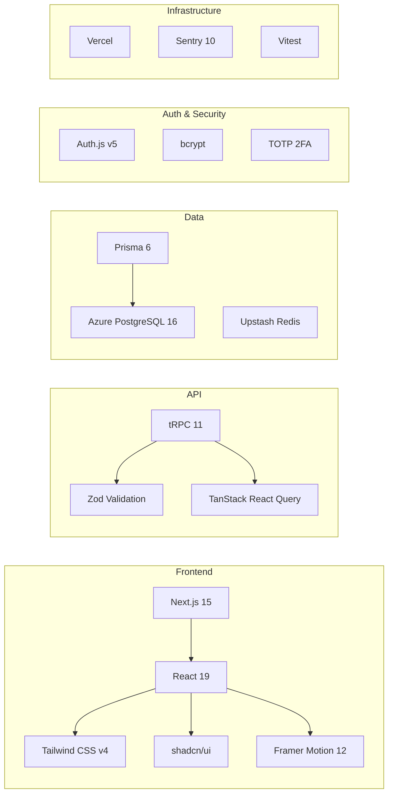

# Tech Stack — Odxis ERP

Technology choices and rationale for every layer of the Odxis platform.

---

## Stack Summary

---

## Core Framework

### Next.js 15 (App Router + Turbopack)

**Why Next.js:**
- Server Components for data-heavy pages (dashboard, reports)
- App Router for nested layouts and route groups
- Turbopack for fast development builds
- Built-in API routes for webhooks (Wompi, Dataico)
- Static generation for public pages (landing, blog)
- Server Actions for form mutations

**Route Groups:**
- `(public)/` — Landing page, blog (SSR + SSG)
- `(auth)/` — Login, registration
- `(dashboard)/` — Protected admin panel with 17 module views

---

## API Layer

### tRPC 11

**Why tRPC over REST or GraphQL:**
- **Zero code generation**: Types flow from server to client automatically
- **Smaller bundle**: No GraphQL client library needed
- **Middleware composability**: Auth → Rate Limit → RBAC → Handler
- **Server-side callers**: `createCaller` for Server Components
- **Batching**: Multiple procedure calls in a single HTTP request

### Zod Validation

Every tRPC input is validated with Zod schemas, ensuring:
- Runtime type safety on server
- Automatic TypeScript inference on client
- Descriptive error messages for invalid data

---

## Data Layer

### Prisma 6

**Why Prisma:**
- Type-safe database queries with auto-generated client
- Declarative schema (68 models, 50 enums in one file)
- Migration system for schema evolution
- Seeding support for development data
- Introspection for existing databases

### Azure PostgreSQL 16

**Why Azure PostgreSQL:**
- Managed service with automatic backups
- PgBouncer connection pooling (port 6432)
- High availability with zone redundant deployment
- Compatible with Prisma's PostgreSQL driver

### Upstash Redis

**Why Upstash:**
- Serverless Redis (no always-on instance)
- Global replication
- Pay-per-request pricing
- Native REST API (works in Edge functions)
- Built-in rate limiting primitives

---

## Authentication

### Auth.js v5 (NextAuth)

**Why Auth.js:**
- First-party Next.js integration
- Prisma adapter for database sessions
- JWT + database session validation
- Extensible session callbacks for RBAC data
- Support for multiple auth providers

### Security Libraries

| Library | Purpose |
|---------|---------|
| `bcryptjs` | Password hashing (pure JS, no native deps) |
| Custom TOTP | Two-factor authentication |
| Upstash Rate Limit | API abuse prevention |

---

## UI Layer

### Tailwind CSS v4 + shadcn/ui

**Why Tailwind:**
- Utility-first for rapid UI development
- v4 with native CSS features (no PostCSS config complexity)
- Consistent design system across 17 modules

**Why shadcn/ui:**
- Copy-paste component library (no dependency lock-in)
- Radix UI primitives for accessibility
- Customizable via Tailwind classes
- Components: tables, forms, dialogs, dropdowns, charts

### Framer Motion 12

**Why Framer Motion:**
- Layout animations for dashboard transitions
- Page transitions between modules
- Micro-interactions for improved UX
- Spring-based physics animations

### Recharts 3

**Why Recharts:**
- React-native chart library
- Declarative API with responsive containers
- Used for POS metrics, financial reports, inventory dashboards

---

## Infrastructure

### Vercel

**Why Vercel:**
- Zero-config Next.js deployment
- Edge Functions for middleware
- Automatic preview deployments
- Analytics integration
- Serverless functions (no server management)

### Sentry 10

**Why Sentry:**
- Error tracking across client, server, and edge
- Performance monitoring with transaction tracing
- Source map support for production debugging
- Alerting for critical errors

---

## Testing

### Vitest

**Why Vitest over Jest:**
- Native ESM support (aligns with `"type": "module"`)
- Faster execution with Vite's transformer
- Compatible with existing test patterns
- Coverage v8 for code coverage reports

---

## Development Tools

| Tool | Version | Purpose |
|------|---------|---------|
| TypeScript | 5.8 | Static type checking across entire codebase |
| ESLint | 9 | Code quality + accessibility rules |
| Prettier | (via config) | Consistent formatting |
| tsx | 4.21 | TypeScript execution for scripts and seeds |
| shadcn CLI | 3.8 | Component scaffolding |

---

## External Integrations

| Service | Purpose | Integration Point |
|---------|---------|------------------|
| **Dataico** | DIAN electronic invoicing | `dian.ts` service |
| **Wompi** | Colombian payment processing | Subscription billing |
| **Vercel Analytics** | Usage tracking | `@vercel/analytics` |
| **Sentry** | Error + performance monitoring | Client, server, edge configs |
